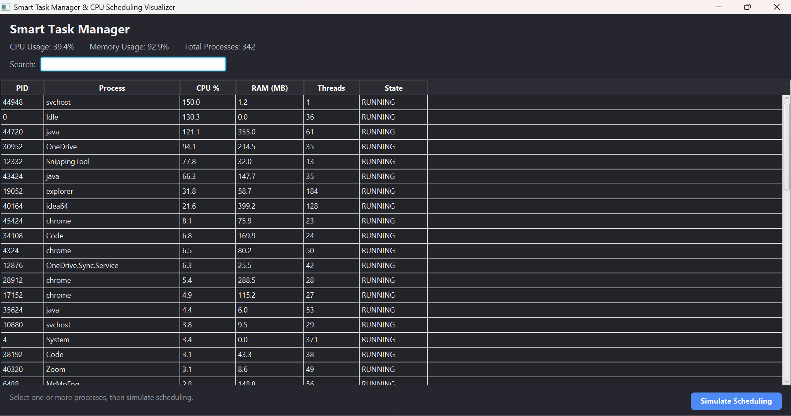
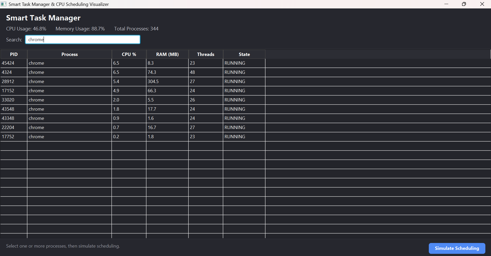
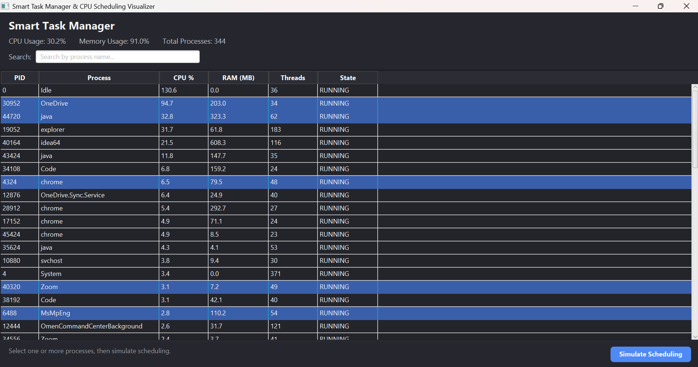

# Smart Task Manager & CPU Scheduling Visualizer

A JavaFX desktop application that combines real-time system process monitoring with CPU scheduling algorithm simulation. The application allows users to monitor active processes, select them for simulation, compare different scheduling algorithms, visualize execution using Gantt charts, and export results as CSV files.

---

## Features

- Live CPU, Memory and Process monitoring
- Search running processes by name
- Select multiple processes for simulation
- Edit Arrival Time, Burst Time and Priority
- Simulate multiple CPU Scheduling algorithms
- Interactive Gantt Chart visualization
- Performance metrics calculation
- Export scheduling results to CSV

---

## CPU Scheduling Algorithms Implemented

- First Come First Serve (FCFS)
- Shortest Job First (Non-Preemptive)
- Shortest Remaining Time First (Preemptive SJF)
- Priority Scheduling (Non-Preemptive)
- Priority Scheduling (Preemptive)
- Round Robin

---

# Screenshots

## Dashboard

Displays all currently running processes with their CPU usage, memory usage, thread count and process state.



---

## Search Running Processes

Quickly filter running processes using the search bar.



---

## Process Selection

Select one or more processes before starting the scheduling simulation.



---

## Simulation Dashboard

Assign arrival time, burst time and priority values before running the selected scheduling algorithm.


---

## Algorithm Selection

Choose from multiple CPU Scheduling algorithms.


---

## Simulation Result

Displays completion time, waiting time, turnaround time, averages and context switches.


---

## Gantt Chart

Visual representation of process execution sequence.


---

## CSV Export

Scheduling results can be exported for further analysis.


---

## Technologies Used

- Java 17
- JavaFX
- Maven
- OSHI (Operating System and Hardware Information)
- CSS
- CSV Export Utility

---

## Project Structure

```
src
├── controller
├── model
├── monitor
├── scheduler
├── util
└── resources
```

---

## Performance Metrics

The simulator calculates:

- Completion Time (CT)
- Waiting Time (WT)
- Turnaround Time (TAT)
- Average Waiting Time
- Average Turnaround Time
- Context Switches

---

## How to Run

Clone the repository

```bash
git clone https://github.com/sadafjumani/Smart-Task-Manager.git
```

Move into the project directory

```bash
cd Smart-Task-Manager
```

Run using Maven

```bash
mvn javafx:run
```

---

## Future Improvements

- Multi-level Queue Scheduling
- Multi-level Feedback Queue Scheduling
- Real-time process graph visualization
- Dark/Light theme support
- Process priority editing from dashboard

---

## Author

**Sadaf Jumani**

GitHub: https://github.com/sadafjumani